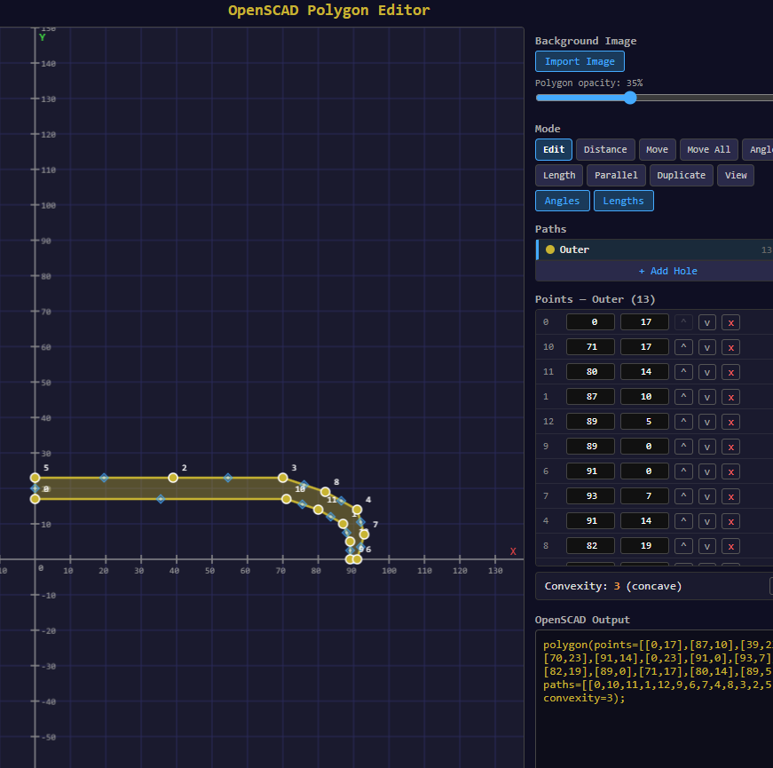
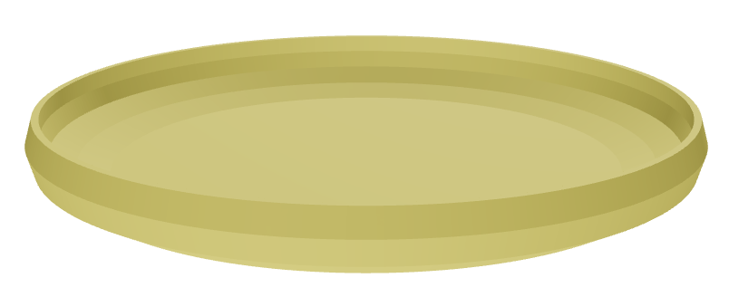

# OpenSCAD Polygon Editor

A browser-based visual editor for creating 2D polygons with hole support, designed for use with OpenSCAD. Build shapes by clicking, adjust with precision tools, then copy the `polygon()` output directly into your `.scad` files.

### web page available
https://leffalompen.github.io/polygon-editor/

## Example make a frisbee:



### Output from polygon-editor:
```
polygon(points=[[0,17],[87,10],[39,23],[70,23],[91,14],[0,23],[91,0],[93,7],[82,19],[89,0],[71,17],[80,14],[89,5]], paths=[[0,10,11,1,12,9,6,7,4,8,3,2,5]], convexity=3);
```

Use it in Openscad to create frisbee:

```
$fs = 1;
$fa = 1;
translate([0,0,23])
  rotate([180,0,0])
    rotate_extrude(angle=360)    
      polygon(points=[[0,17],[87,10],[39,23],[70,23],[91,14],[0,23],[91,0],[93,7],[82,19],[89,0],[71,17],[80,14],[89,5]], paths=[[0,10,11,1,12,9,6,7,4,8,3,2,5]], convexity=3);
```



## Getting Started

```bash
cd polygon-editor
npm install
npm run dev
```

Open `http://localhost:5173` in your browser. The editor is optimized for a 2000x1300 window.

## Simple editor
There is not real constraints. But it is possible to edit angles, lengths and parallel lines. They do however destroy for each other and are not kept.

## Basic Controls

| Action | Control |
|---|---|
| Insert a point | Click an edge midpoint (diamond marker) |
| Move a point | Shift + drag the point |
| Select a point | Click the point |
| Pan the canvas | Middle-mouse drag, or Shift + click empty space |
| Zoom | Scroll wheel |

The editor starts with a default triangle. Points snap to a 1-unit grid. The Y-axis points up (matching OpenSCAD convention).

## Editing Modes

Switch modes using the toolbar in the sidebar.

### Edit (default)
Click edge midpoints to insert new points. Shift+drag to move existing points. Click a point to select it and view/edit its coordinates in the sidebar.

### Distance
Set the perpendicular distance from a point to a line:
1. Click a point
2. Click an edge (on any path)
3. Enter the desired distance and press Apply

The point moves along the perpendicular to the edge. Uses exact floating-point math (no grid snapping).

### Move
Drag anywhere on the canvas to translate all points in the active path together. Other paths remain fixed.

### Move All
Drag to translate every point in every path together, preserving all relative positions.

### Angle
Set the angle between two edges at a shared vertex:
1. Click point A (first edge endpoint)
2. Click point B (the vertex)
3. Click point C (second edge endpoint)
4. Enter the desired angle and press Apply

Point C rotates around B to achieve the target angle. The BC edge length is preserved.

### Length
Set the length of an edge:
1. Click an edge (on any path)
2. Enter the desired length and press Apply

The second endpoint moves along the edge direction to match the new length.

### Parallel
Make one edge parallel to another:
1. Click the base edge (reference direction)
2. Click the target edge (the one to rotate)
3. Click "Make Parallel"

The target edge rotates around its midpoint to match the base edge's angle, preserving its length. Chooses the closer of the two parallel directions.

### Duplicate
Create a copy of the active path:
1. Click the "Duplicate" button in the panel
2. Drag on the canvas to position the copy

The copy gets new points (independent of the original) and can be repositioned by dragging. Any active path can be dragged in this mode.

### View
A read-only mode that displays all angles and edge lengths on the canvas. No editing is possible. Useful for reviewing your shape.

- Angles and lengths are shown by default; toggle them off/on with the Angles and Lengths buttons
- Copy to Clipboard, mode switching, and opacity sliders remain available
- Pan and zoom still work (shift+click to pan)

## Overlay Buttons

Below the mode toolbar:

- **Angles** -- In edit modes: hold to temporarily show all vertex angles. In View mode: toggle on/off.
- **Lengths** -- In edit modes: hold to temporarily show all edge lengths. In View mode: toggle on/off.

## Paths (Holes)

The editor supports multiple paths for creating shapes with holes:

- **paths[0]** is always the outer shape (gold)
- **paths[1+]** are holes (red, blue, purple, green, orange)
- Click "+ Add Hole" to create a new hole (starts as a small triangle near the center)
- Click the "x" button to remove a hole
- Click a path in the list to make it active (only the active path can be edited)
- Double-click a path name to rename it
- Holes render as cutouts using the even-odd fill rule

## Point Editing

The sidebar shows all points in the active path:

- Edit X/Y coordinates directly via the number inputs
- Reorder points within the path using the ^ and v buttons
- Remove a point with the x button (minimum 3 points per path)

## OpenSCAD Output

The output panel shows the `polygon()` call ready to paste into OpenSCAD:

```
polygon(points=[[0,0],[50,0],[25,40]], paths=[[0,1,2]]);
```

### or the frisbee
```
polygon(points=[[0,17],[87,10],[39,23],[70,23],[91,14],[0,23],[91,0],[93,7],[82,19],[89,0],[71,17],[80,14],[89,5]], paths=[[0,10,11,1,12,9,6,7,4,8,3,2,5]], convexity=3);
```

- Only referenced points are included
- Points are re-indexed to be contiguous
- Path winding order is always preserved via the `paths=` parameter
- Convexity is auto-calculated and included when greater than 1
- Click "Copy to Clipboard" to copy the output

## Importing

### Import from OpenSCAD
Click "Import from OpenSCAD" below the output, paste a `polygon(points=..., paths=...)` string, and click Load. Supports both single-path and multi-path polygons.

### Background Image
Click "Import Image" to load a PNG or JPEG as a tracing reference. Adjust opacity with the slider. The image is positioned with its bottom-left corner at the origin.

## History

- **Undo**: Ctrl+Z or click Undo
- **Redo**: Ctrl+Y or click Redo
- Click any entry in the history list to jump to that state
- History is stored in localStorage (up to 50 entries)
- Path names are part of the undo history

## Building

```bash
cd polygon-editor
npm run build      # typecheck + production build
npm run preview    # serve the production build
```

## Tech Stack

- React + TypeScript
- Vite
- Single component (`App.tsx`), no routing, no state library
- Canvas API for rendering
- localStorage for persistence
